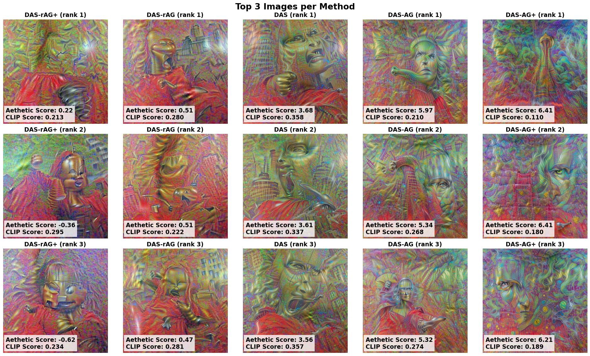

# DAS-AG v2: Image Generation with Aesthetic Guidance

This project is the successor to the original [DAS-AG](https://github.com/bilzard/DAS-AG) project.
For details, refer to the original project.

## New Features in v2

* Uses a newer aesthetic score prediction model **Aesthetic Predictor V2.5** [3], which is based on SigLIP [4].
* Supports higher image resolutions: **384×384** and **768×768**.
* Introduces an optional non-linear loss mapping using `arctanh`.
* Anneals the max-shift parameter in positional jitter augmentation to zero over the training schedule.
* Integrates **FlashAttention v2** [5] to accelerate image generation.

## Prerequisites

- [uv](https://docs.astral.sh/uv/concepts/tools/)
- NVIDIA Ampere or newer GPUs (for FlashAttention v2)

## Install

### Install Required Packages

This project requires the `flash-attn` package, which has specific build dependencies.
To ensure proper installation, we need to run `uv sync` twice:

1. Install standard dependencies:
    ```bash
    uv sync --extra build
    ```
2. Compile and install flash-attn:
    ```bash
    uv sync --extra build --extra compile
    ```

For more details, please refer to [official documentation of uv](https://docs.astral.sh/uv/concepts/projects/config/#build-isolation).

**Note**: If you want to add a new dependency to the `build` optional dependencies, use the following command:
```bash
uv add --optional build torchvision
```

### Download Pre-trained Model

#### Download SigLIP Model

```bash
huggingface-cli download google/siglip-so400m-patch14-384 \
    --local-dir /path/to/local \
    --local-dir-use-symlinks False
```

#### Download Aesthetic Predictor V2.5

```bash
wget https://github.com/discus0434/aesthetic-predictor-v2-5/raw/main/models/aesthetic_predictor_v2_5.pth /path/to/local
```

#### Update Environment Variables

Make sure to update `.env` with the correct path:

```bash
SIGLIP_MODEL_PATH="/path/to/google/siglip-so400m-patch14-384"
AESTHETIC_PREDICTOR_MODEL_PATH="/path/to/aesthetic_predictor_v2_5.pth"
PROJECT_ROOT="/path/to/DAS-AG-v2"
```

## Execute Application

### Running the Demo

To run the demo, execute the following command:
```bash
uv run streamlit run src/app.py
```

### Reproducible Execution

If you need **deterministic results**, use one of the following commands instead.
This ensures consistent computations for training but may reduce efficiency.

```bash
CUBLAS_WORKSPACE_CONFIG=:4096:8 uv run streamlit run src/app.py
# or
CUBLAS_WORKSPACE_CONFIG=:16:8 uv run streamlit run src/app.py
```

For more details on reproducibility, see the [NVIDIA cuBLAS documentation](https://docs.nvidia.com/cuda/cublas/index.html#results-reproducibility).

## Reproducing Experimental Result

### Generate Images

This script generates 5 images per method. Images are output to `data/generated_images_v2` directory, and the metadata is generated in `data/score_v2.csv`

```bash
uv run src/generate.py
```

### Calculate Result

Run notebook `notebook/evaluate_v2.ipynb`.

## Reproducing Experimental Results

### 1. Generate Images

Run the script below to generate 5 images per method.
The generated images will be saved in `data/generated_images_v2/`, and metadata will be stored in `data/score_v2.csv`.

```bash
uv run src/generate.py
```

### 2. Evaluate Results

Execulte `notebook/evaluate_v2.ipynb`.
This notebook will generate all experimental results including statistics, graphs, and tables.

## Results

### Quantitative Evaluation of Different Methods

The following methods are evaluated:

- **DAS-AG**: Aesthetic guidance with decay rate = 0.02
- **DAS-AG+**: Aesthetic guidance with a higher decay rate = 0.06
- **DAS-rAG**: Reverse aesthetic guidance with decay rate = 0.02
- **DAS-rAG+**: Reverse aesthetic guidance with a higher decay rate = 0.06


**Figure 1: CLIP vs Aesthetic Score**

## Top 3 High Aesthetic Score Images per Method



The images displayed in this table were generated using the following prompts:

**Positive Prompt**:

```
A photorealistic illustration of "a gigantic metallic Mona Lisa in red pajama attacking the city", dynamic camera angle, fine-grained details
```

**Negative Prompt 1**:

```
text present, low-quality, low-resolution, blurred, noisy, distorted, pixelated, artifact present, without depth, flat, boring, uninteresting, unattractive, unappealing, unclear
```

**Negative Prompt 2**:

```
nude, naked, nsfw, porn, explicit, erotic, sexual, lewd, hentai, pornography, censored, 18+, sex, sensual, suggestive, perverted, obscene, adult content
```

## Acknowledgements

This project builds upon the work presented in *Direct Ascent Synthesis* (DAS) [1]. I would like to thank to the authors for their contributions.

Additionally, this project makes use of the following publicly available tools. I also would like to thank the authors for their work:

- **@discus0434**: [Aesthetic Predictor V2.5](https://github.com/discus0434/aesthetic-predictor-v2-5) (used for image generation and evaluation, licensed under AGPL-3.0)

## License

This project is licensed under the Apache License 2.0.

## Important License Considerations

This project itself is licensed under the **Apache License 2.0**. However, please note that it makes use of external tools that are licensed under different terms.

### Use of AGPL-3.0 Licensed Components
This project utilizes the **Aesthetic Predictor V2.5** model, which is licensed under **AGPL-3.0**. While this does not impose AGPL-3.0 obligations on this repository itself, third parties who **deploy this software on a public server** should be aware of potential **AGPL-3.0 license obligations**.

Specifically, third parties may be required to **disclose the corresponding source code and related information** of the AGPL-3.0-licensed model.

For more details, please refer to the [GNU AGPL-3.0 License](https://www.gnu.org/licenses/agpl-3.0.html).

## References

- [1] Direct Ascent Synthesis: Revealing Hidden Generative Capabilities in Discriminative Models, 11 Feb 2025, https://arxiv.org/abs/2502.07753
- [2] https://github.com/stanislavfort/Direct_Ascent_Synthesis
- [3] Aesthetic Predictor V2.5, https://github.com/discus0434/aesthetic-predictor-v2-5
- [4] Model Card of `google/siglip-so400m-patch14-384`, https://huggingface.co/google/siglip-so400m-patch14-384
- [5] FlashAttention v2, https://github.com/Dao-AILab/flash-attention